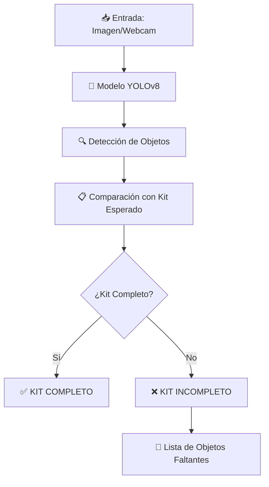

<div align="center">

# 🧠 Inspector de Completitud de Kit (YOLOv8)

[](https://www.python.org/)
[](https://github.com/ultralytics/ultralytics)
[](https://opencv.org/)
[](LICENSE)

**Sistema de Visión Artificial para verificación automática de completitud de kits**

[🎥 Ver Demo](#-video-de-presentación) • [📖 Documentación](#-tabla-de-contenidos) • [🚀 Instalación](#️-5-requisitos-e-instalación) • [💻 Uso](#️-7-uso-del-proyecto)

---

</div>

## 🧾 Descripción General

El **Inspector de Completitud de Kit** es un sistema de visión artificial basado en **YOLOv8** cuyo objetivo es verificar automáticamente si un kit contiene todos los objetos requeridos antes de ser entregado o despachado.

### 🎯 Características Principales

- ✅ **Detección en tiempo real** con webcam
- 📸 **Análisis de imágenes estáticas**
- 🤖 **Modelo YOLOv8 personalizado** entrenado con 6 clases
- ⚡ **Sistema Pass/Fail** automático
- 📊 **Métricas de rendimiento** (FPS, mAP, Precision, Recall)

### 🎨 Objetos Detectados

El sistema identifica los siguientes objetos:

| Objeto | Descripción |
|--------|-------------|
| 🔌 `enchufe` | Enchufe eléctrico |
| 🎧 `headset` | Audífonos |
| 👓 `lentes` | Anteojos |
| 🔑 `llave` | Llave |
| ✏️ `objects` | Lápiz |
| 💳 `tarjeta` | Tarjeta |

---

## 📖 Tabla de Contenidos

<details open>
<summary><b>Clic para expandir/contraer</b></summary>

1. [🎯 Objetivos del Proyecto](#-2-objetivos-del-proyecto)
2. [🗺️ Arquitectura y Flujo del Sistema](#️-3-arquitectura-y-flujo-del-sistema)
3. [📂 Estructura del Repositorio](#-4-estructura-del-repositorio)
4. [🛠️ Requisitos e Instalación](#️-5-requisitos-e-instalación)
5. [📸 Dataset y Entrenamiento](#-6-dataset-y-entrenamiento-del-modelo)
6. [▶️ Uso del Proyecto](#️-7-uso-del-proyecto)
7. [📊 Métricas y Resultados](#-8-métricas-y-resultados)
8. [⚠️ Limitaciones y Trabajo Futuro](#️-9-limitaciones-y-trabajo-futuro)
9. [👥 Créditos y Autores](#-10-créditos-y-autores)

</details>

---

## 🎯 2. Objetivos del Proyecto

### 📌 Objetivo General

Implementar un modelo de detección de objetos que identifique los componentes de un kit y determine automáticamente si está completo o incompleto.

### 🎯 Objetivos Específicos

<table>
<tr>
<td width="50%">

**📊 Dataset**
- Crear dataset personalizado
- Anotar y limpiar datos
- Optimizar para diferentes condiciones

</td>
<td width="50%">

**🤖 Modelo**
- Entrenar YOLOv8 personalizado
- Optimizar para detección rápida
- Validar con métricas robustas

</td>
</tr>
<tr>
<td width="50%">

**💻 Implementación**
- Sistema con imagen estática
- Inspector en tiempo real
- Comparación con lista esperada

</td>
<td width="50%">

**📈 Evaluación**
- Medir métricas de desempeño
- Documentar proceso completo
- Crear demo funcional

</td>
</tr>
</table>

---

## 🗺️ 3. Arquitectura y Flujo del Sistema



### 🔄 Flujo de Procesamiento

```
┌─────────────────────┐
│  Imagen o Webcam    │
└──────────┬──────────┘
           │
           ▼
┌─────────────────────┐
│   Modelo YOLOv8     │
│ (detección de 6 cls)│
└──────────┬──────────┘
           │
           ▼
┌─────────────────────┐
│ Comparación con Kit │
│ esperado (PASS/FAIL)│
└──────────┬──────────┘
           │
           ▼
┌─────────────────────┐
│ Salida visual/texto │
│ (imagen/video + est)│
└─────────────────────┘
```

---

## 📂 4. Estructura del Repositorio

```
Inspector-Completitud/
│
├── 📄 README.md                    # Documentación principal
├── 📄 LICENSE                      # Licencia del proyecto
├── 📄 .gitignore                   # Archivos ignorados
│
├── 📄 best.pt                      # 🤖 Modelo YOLOv8 entrenado (5.96 MB)
│
├── 📄 inspector_foto.py            # 📸 Demo con imagen estática
├── 📄 inspector_webcam.py          # 🎥 Inspector con webcam en tiempo real
│
├── 📁 resultados/                  # Resultados y métricas
│   ├── predicciones/               # Imágenes generadas por el modelo
│   ├── metrics.png                 # Gráficos de entrenamiento
│   └── confusion_matrix.png        # Matriz de confusión
│
└── 📁 ejemplo/                     # Imágenes de prueba
    └── imagen_prueba.jpg
```

### 📌 Nota sobre el Modelo

El archivo `best.pt` está incluido en el repositorio. Debido a su tamaño (5.96 MB), GitHub no lo muestra directamente, pero está disponible para descarga.

---

## 🛠️ 5. Requisitos e Instalación

### 📋 Requisitos del Sistema

<table>
<tr>
<td width="50%">

**💻 Hardware**
- CPU: Intel i5 o superior
- RAM: 8 GB mínimo
- GPU: NVIDIA (opcional, mejora FPS)
- Webcam para demo en tiempo real

</td>
<td width="50%">

**🐍 Software**
- Python 3.10 o 3.11
- Windows 10/11 o Linux
- Anaconda/Miniconda (recomendado)
- Git (opcional)

</td>
</tr>
</table>

---

### 🚀 Instalación Rápida

#### **Paso 1: Clonar el Repositorio**

```bash
git clone https://github.com/tu-usuario/Inspector-Completitud.git
cd Inspector-Completitud
```

#### **Paso 2: Crear Entorno Virtual**

```bash
# Crear entorno con Conda
conda create -n kit-inspector python=3.11

# Activar entorno
conda activate kit-inspector
```

#### **Paso 3: Instalar Dependencias**

```bash
# Librerías principales
pip install ultralytics opencv-python

# Librerías adicionales (opcional)
pip install numpy matplotlib
```

#### **Paso 4: Verificar Instalación**

```bash
python -c "from ultralytics import YOLO; import cv2; print('✅ Instalación exitosa')"
```

---

### 📥 Descarga del Modelo

El modelo entrenado está incluido en el repositorio: [`best.pt`](best.pt) **(5.96 MB)**

**Formas de obtener el modelo:**

1. **Clonar el repositorio completo** (recomendado):
   ```bash
   git clone https://github.com/tu-usuario/Inspector-Completitud.git
   ```
   El archivo `best.pt` se descarga automáticamente.

2. **Descargar solo el archivo**:
   - Navega a [`best.pt`](best.pt) en GitHub
   - Haz clic en **"Download raw file"** (esquina superior derecha)

---

## 📸 6. Dataset y Entrenamiento del Modelo

### 📊 Dataset Personalizado

El dataset fue creado y gestionado con **Roboflow**, incluyendo:

- **Total de imágenes**: ~300
- **Anotaciones**: Bounding boxes manuales
- **Versiones**: v1 → v6 (iteraciones de mejora)
- **Formato**: YOLOv8

### 🎨 Distribución de Clases

| Clase | Cantidad de Imágenes | Dificultad |
|-------|---------------------|-----------|
| 👓 lentes | ~80 | ⭐ Fácil |
| 💳 tarjeta | ~75 | ⭐ Fácil |
| 🎧 headset | ~70 | ⭐⭐ Media |
| 🔌 enchufe | ~65 | ⭐⭐ Media |
| 🔑 llave | ~50 | ⭐⭐⭐ Difícil |
| ✏️ objects | ~45 | ⭐⭐⭐ Difícil |

### 🏋️ Proceso de Entrenamiento

```python
from ultralytics import YOLO

# Modelo base
model = YOLO("yolov8n.pt")

# Entrenamiento
model.train(
    data="dataset/data.yaml",
    epochs=30,
    imgsz=640,
    batch=8,
    project="Vision_artificial",
    name="kit_model_refinado"
)
```

**Resultado:** Modelo [`best.pt`](best.pt) con métricas optimizadas.

---

## ▶️ 7. Uso del Proyecto

### 📸 7.1 Demo con Imagen Estática

**Archivo:** [`inspector_foto.py`](inspector_foto.py)

#### 🔧 Configuración

Edita las rutas en el script:

```python
MODEL_PATH = "best.pt"  # Ruta al modelo
IMAGE_PATH = "ejemplo/imagen_prueba.jpg"  # Ruta a tu imagen
```

#### ▶️ Ejecución

```bash
python inspector_foto.py
```

#### ✅ Resultado

- Ventana con detecciones en tiempo real
- Bounding boxes con clases y confianza
- Imagen guardada en `/resultados/`

---

### 🎥 7.2 Inspector con Webcam (Tiempo Real)

**Archivo:** [`inspector_webcam.py`](inspector_webcam.py)

#### 🔧 Configuración

```python
MODEL_PATH = "best.pt"  # Ruta al modelo
```

#### ▶️ Ejecución

```bash
python inspector_webcam.py
```

#### 🎮 Controles

- **Q**: Cerrar la aplicación
- **ESC**: Salir

#### 📊 Información en Pantalla

```
┌─────────────────────────────────┐
│  🎥 Inspector de Completitud    │
├─────────────────────────────────┤
│  enchufe: 1/1  ✅               │
│  headset: 1/1  ✅               │
│  lentes: 1/1   ✅               │
│  llave: 0/1    ❌               │
│  objects: 1/1  ✅               │
│  tarjeta: 1/1  ✅               │
├─────────────────────────────────┤
│  Estado: KIT INCOMPLETO ❌      │
│  Faltantes: llave               │
│  FPS: 12.5                      │
└─────────────────────────────────┘
```

---

### ⚙️ Ajustes Avanzados

<details>
<summary><b>Clic para ver configuraciones opcionales</b></summary>

#### 🎚️ Ajustar Confianza Mínima

```python
results = model(frame, conf=0.25)  # Más detecciones
results = model(frame, conf=0.50)  # Menos falsos positivos
```

#### 📹 Cambiar Cámara

```python
cap = cv2.VideoCapture(0)  # Cámara predeterminada
cap = cv2.VideoCapture(1)  # Cámara secundaria
```

#### 📝 Modificar Kit Esperado

```python
KIT_DEFINITION = {
    "enchufe": 1,
    "headset": 1,
    "lentes": 1,
    "llave": 2,      # Requiere 2 llaves
    "objects": 1,
    "tarjeta": 1
}
```

</details>

---

## 📊 8. Métricas y Resultados

### 🎯 Resultados Globales

<div align="center">

| Métrica | Valor | Interpretación |
|---------|-------|----------------|
| **Precision** | 0.95 | Casi nunca se equivoca |
| **Recall** | 0.84 | Detecta la mayoría de objetos |
| **mAP@50** | 0.91 | Excelente en IoU=0.5 |
| **mAP@50-95** | 0.82 | Robusto en todos los umbrales |

</div>

### 📈 Desempeño por Clase

```
👓 lentes     ████████████████████ 0.98  ⭐⭐⭐⭐⭐
💳 tarjeta    ███████████████████▌ 0.99  ⭐⭐⭐⭐⭐
🎧 headset    ███████████████████  0.94  ⭐⭐⭐⭐
🔌 enchufe    █████████████████    0.86  ⭐⭐⭐⭐
🔑 llave      ███████████████▌     0.93  ⭐⭐⭐
✏️ objects    ████████████         0.61  ⭐⭐
```

### ⚡ Rendimiento en Tiempo Real

| Hardware | FPS | Uso |
|----------|-----|-----|
| 💻 CPU Intel i5 | 8-15 FPS | Funcional |
| 🎮 GPU NVIDIA RTX | 25-45 FPS | Óptimo |

---

## ⚠️ 9. Limitaciones y Trabajo Futuro

### 🚧 Limitaciones Actuales

<table>
<tr>
<td width="50%">

**📊 Dataset**
- Variabilidad limitada en algunos objetos
- Pocas imágenes de llave y lápiz
- Sensible a iluminación extrema

</td>
<td width="50%">

**⚙️ Sistema**
- Velocidad limitada en CPU
- Objetos delgados difíciles de detectar
- Solo reconoce objetos específicos

</td>
</tr>
</table>

### 🚀 Mejoras Futuras

- 🌱 **Aumentar dataset** con más variaciones
- 💡 **Data augmentation** avanzado (blur, noise)
- 📦 **Soporte para más objetos** del kit
- 🖥️ **Interfaz gráfica** con Tkinter/Streamlit
- 📱 **Despliegue en dispositivos embebidos** (Raspberry Pi)
- 🧠 **Entrenamiento continuo** con nuevos datos

---

## 🎥 Video de Presentación

<div align="center">

[](https://drive.google.com/drive/folders/1RXk7xu1j3GCMyBRRy-pfG9NR_yxp8fPY?usp=sharing)

**Duración:** 15 minutos | **Contenido:** Problema, motivación, dataset, funcionamiento completo y en vivo del sistema conclusiones

</div>

---

## 👥 10. Créditos y Autores

| Integrante | Email |
|------------|-------|
| Bastián Gálvez | bastian.galvez@mayor.cl |
| Bruno Meza | bruno.meza@mayor.cl |
| Miguel Retamal | miguel.retamal@mayor.cl |
| Diego Villalón | diego.villalong@mayor.cl |

---

<div align="center">

### 🛠️ Tecnologías Utilizadas


---

### 📄 Licencia

Este proyecto está bajo la Licencia MIT - ver el archivo [LICENSE](LICENSE) para más detalles.

---

</div>
